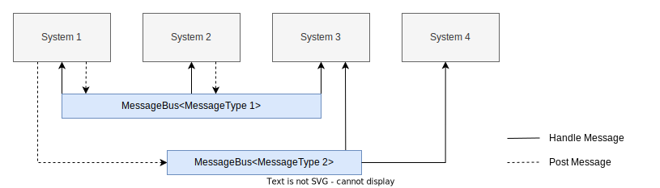

# WormHoles
[](https://github.com/helcl42/WormHoles/actions/workflows/cmake-multi-platform.yml)
[](https://app.codacy.com/gh/helcl42/WormHoles/dashboard?utm_source=gh&utm_medium=referral&utm_content=&utm_campaign=Badge_grade)

WormHoles is a multiplatform, header-only library implementing a general and thread-safe event bus.



---

## Overview

WormHoles is designed for dispatching messages/events through a system and between its components. An event can be any copyable C++ object. The library supports three dispatch options and is built around two core constructs: **broadcasting** and **handling**. The project has two examples: simple and a bit more complex. For more info, see the sections below.


- **Broadcasting**: Dispatch an event using:
  ```cpp
  worm::EventChannel::Post(<AN_EVENT>, <DISPATCH_TYPE>);
  ```
 - **Handling**: Manage broadcasted events by adding the following member:
```cpp
  worm::EventHandler< <HANDLER_REFERENCE_TYPE>, <EVENT_TYPE> > m_handler{ <HANDLER_REFERENCE> };
```
and a handle function:
```cpp
  void operator()(const <EVENT_TYPE>& evt);
```

### Dispatch Options
 - `SYNC` - The event is dispatched directly within the current thread(the default one).
 - `ASYNC` - The event is dispatched on another thread from the internal thread pool. It might prevent you from long blocking in event handlers, which is currently a suboptimal solution. Whenever we want to make sure all messages are delivered we might just call `worm::EventChannel::DispatchAllAsync();`.
 - `QUEUED` - The event is dispatched when `worm::EventChannel::DispatchAllQueued();` is called. It might be somewhere at the beginning of your main loop.

### Build instructions
- Run `mkdir build && cd build`
- Run `cmake -G Ninja ..`
- Run `ninja`

### Run tests
 - Run `ctest --test-dir . --verbose`

## Examples
### Example 1: Logger System

This example demonstrates how to create a loosely coupled logger. Neither `Logger` nor `NetworkLogger` directly interacts with the `System` class. Instead, they post events to the `EventChannel`.

```cpp
#include <worm/EventChannel.h>
#include <worm/EventHandler.h>

#include <chrono>
#include <iostream>
#include <string>
#include <thread>

enum class Severity {
    LOG,
    INFO,
    WARNING,
    ERROR
};

// Event structure for logging
struct LogEvent {
    Severity severity;
    std::string message;
};

class Logger {
public:
    void operator()(const LogEvent& logItem) {
        std::cout << "[Logger] " << logItem.message << std::endl;
    }

private:
    worm::EventHandler<Logger, LogEvent> m_handler{ *this };
};

class NetworkLogger {
public:
    void operator()(const LogEvent& logItem) {
        std::cout << "[NetworkLogger] " << logItem.message << std::endl;
    }

private:
    worm::EventHandler<NetworkLogger, LogEvent> m_handler{ *this };
};

class System {
public:
    void Init() {
        worm::EventChannel::Post(LogEvent{ Severity::INFO, "System initialized" }, worm::DispatchType::SYNC);
    }

    void Update() {
        m_counter++;
        worm::EventChannel::Post(LogEvent{ Severity::INFO, "System updated - " + std::to_string(m_counter) }, worm::DispatchType::ASYNC);
    }

    void Shutdown() {
        worm::EventChannel::Post(LogEvent{ Severity::INFO, "System shut down" }, worm::DispatchType::SYNC);
    }

private:
    uint32_t m_counter{ 0 };
};

int main() {
    Logger logger;
    NetworkLogger networkLogger;
    System system;

    system.Init();

    for (uint32_t i = 0; i < 50; ++i) {
        system.Update();
        std::this_thread::sleep_for(std::chrono::milliseconds(100));
    }

    system.Shutdown();

    return 0;
}
```
### Example 2: Subsystems and Notifications

This example demonstrates a more advanced usage of the `WormHoles` library. A main `System` starts two independent `Subsystem`s, each running in its own thread. The `Subsystem`s notify the main `System` about their progress, which generates `LogEvent`s.

```cpp
#include <worm/EventChannel.h>
#include <worm/EventHandler.h>

#include <atomic>
#include <chrono>
#include <iostream>
#include <mutex>
#include <string>
#include <thread>

enum class Severity {
    LOG,
    INFO,
    WARNING,
    ERROR
};

// Event structure for logging
struct LogEvent {
    Severity severity;
    std::string message;
};

struct NotifyEvent {
    std::string subSystemName;
    std::string statusString;
};

class StdOutLogger final {
public:
    void operator()(const LogEvent& logItem)
    {
        std::cout << "Logging message to stdout: " << logItem.message << " ThreadId: " << std::this_thread::get_id() << std::endl;

        std::this_thread::sleep_for(std::chrono::milliseconds(20));

        // do whatever you want with logItem -> just to sdout here
        // ...
    }

private:
    worm::EventHandler<StdOutLogger, LogEvent> m_logEventsHandler{ *this };
};

class NetworkLogger final {
public:
    void operator()(const LogEvent& logItem)
    {
        std::cout << "Logging message to network: " << logItem.message << " ThreadId: " << std::this_thread::get_id() << std::endl;

        std::this_thread::sleep_for(std::chrono::milliseconds(40));

        // do whatever you want with logItem -> pass it to web-socket if you need
        // ...
    }

private:
    worm::EventHandler<NetworkLogger, LogEvent> m_logEventsHandler{ *this };
};

class SubSystem {
public:
    SubSystem(const std::string& name, const std::string& buildingBlock, uint64_t timeout)
        : m_name(name), m_buildingBlock(buildingBlock), m_timeoutInMs(timeout), m_running(false) {}

    void Init() {
        std::scoped_lock lock(m_mutex);
        if (m_running) return;

        m_running = true;
        m_thread = std::thread(&SubSystem::Loop, this);
        worm::EventChannel::Post(LogEvent{ Severity::INFO, "SubSystem " + m_name + " initialized" }, worm::DispatchType::SYNC);
    }

    void Shutdown() {
        std::scoped_lock lock(m_mutex);
        if (!m_running) return;

        m_running = false;
        if (m_thread.joinable()) m_thread.join();
        worm::EventChannel::Post(LogEvent{ Severity::INFO, "SubSystem " + m_name + " shut down" }, worm::DispatchType::SYNC);
    }

private:
    void Loop() {
        while (m_running) {
            m_statusString += m_buildingBlock;
            worm::EventChannel::Post(NotifyEvent{ m_name, m_statusString }, worm::DispatchType::QUEUED);
            std::this_thread::sleep_for(std::chrono::milliseconds(m_timeoutInMs));
        }
    }

    std::string m_name;
    std::string m_buildingBlock;
    uint64_t m_timeoutInMs;
    std::string m_statusString;
    std::thread m_thread;
    mutable std::mutex m_mutex;
    std::atomic<bool> m_running;
};

class System {
public:
    void Init() {
        m_subSystemX.Init();
        m_subSystemY.Init();
        worm::EventChannel::Post(LogEvent{ Severity::INFO, "System initialized" }, worm::DispatchType::ASYNC);
    }

    void Update() {
        ++m_counter;
        worm::EventChannel::Post(LogEvent{ Severity::INFO, "System updated - " + std::to_string(m_counter) }, worm::DispatchType::ASYNC);
    }

    void Shutdown() {
        m_subSystemX.Shutdown();
        m_subSystemY.Shutdown();
        worm::EventChannel::Post(LogEvent{ Severity::INFO, "System shut down" }, worm::DispatchType::ASYNC);
    }

    void operator()(const NotifyEvent& notify) {
        worm::EventChannel::Post(LogEvent{ Severity::INFO, "System notified by " + notify.subSystemName + ": " + notify.statusString }, worm::DispatchType::SYNC);
    }

private:
    worm::EventHandler<System, NotifyEvent> m_notifyEventsHandler{ *this };
    SubSystem m_subSystemX{ "SubSystemX", "X", 250 };
    SubSystem m_subSystemY{ "SubSystemY", "Y", 375 };
    uint32_t m_counter{ 0 };
};

int main() {
    StdOutLogger stdOutLogger;
    NetworkLogger networkLogger;

    System system;

    system.Init();

    for (uint32_t i = 0; i < 50; ++i) {
        worm::EventChannel::DispatchAllQueued();
        system.Update();
        std::this_thread::sleep_for(std::chrono::milliseconds(100));
    }

    worm::EventChannel::DispatchAll();
    
    system.Shutdown();

    return 0;
}
```